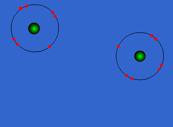

# Unit 1

## Types of matter
### Solids
- particles vibrate in place but can't move arund
- fixed shape
- fixed volume
### Liquids
- particles move around but are still close together
- variable shape
- fixed volume
### Gases
- particles separate and move throughout the container
- variable shape
- variable volume

## Phase Changes
### Energy
Either Endothermic:
- Melting: solid to liquid
- Vaporization: liquid to gas or vapor
- Sublimation: solid to gas
Or Exothermic:
- Freezing: liquid to solid
- Condensation: gas to liquid
- Deposition: gas to solid
### Heat
- The heat needed to melt a solid is called the heat of fusion
- The heat released when solid forms from a liquid is called the heat of solidification
- The heat needed to boil a liquid is called the heat of vaporization (cal/g or J/g )
- The heat released when a liquid forms from a gas is called the heat of condensation
### All phase changes
- Melting (Solid → Liquid)
- Freezing (Liquid → Solid)
- Vaporization (Liquid → Gas)
- Condensation (Gas → Liquid)
- Deposition (Gas → Solid)
- Sublimation (Solid → Gas)

## Volume, Density
### Volume
- amount of space an object takes up
- liter, mL, cm^3
- Measure
  - regular: h * w * l
  - irregular: displacement in cylinder
### Density
- amount of matter per unit of volume
- 
- Measure
  - Density = mass/volume

## Conservation of Mass
### Mass
- Mass is a property of all matter.  It tells us how much matter an object contains
- kg
- **Not Weight**
- Measure
  - mass balance or triple beam balance
### Matter
- Matter is anything that has mass and takes up space
- Measure by mass
### Conservation of Mass
- Matter cannot be created or destroyed in chemical or physical changes.
- The amount you start with is the same that you end with
- The matter can change, but still has to be there, even if you can’t see it
- The amount of matter stays the same
### Changes in Matter
- Physical Changes
  - Matter changes in shape or form, but not what it is.
  - Heating Water
  - Breaking glass
  - Chopping wood
- Chemical Changes:
  - Changes the matter into a new substance
  - Changes *chemical* orientation of substance
  - Iron rusting
  - cooking an egg
  - buring wood
## Measurement/Significant Figures
### Precision vs. Accuracy
- Precision is how close one is to the same answer (consistency)
- Accuracy is how close one is to the expected result (correct answer)

### Metric conversions
- Base Units:
  - Mass =gram
  - Volume = Liter
  - Length = meter
- Kilo to Base to Milli conversions
  - Conversion from base units to milli-units:(*1000)
  - Conversion from base units to kilo-units:(/1000)

### Significant Figures
*future prakash here: don't be like me, study this, it will be on the test*
- All digits that are known to be accurate plus ONE digit that is estimated
- Ensure that data collected in experiments are not manipulated or presented in a misleading manne
### Significant Figure Rules/Examples
***everything between | is significant***
- All non zero digits are significant
  - |24.7|
  - 0|.743|
  - |714|00
- Zeros BETWEEN nonzero digits are significant
  - |7003|
  - |40.79|
  - |1.503|
- Zeros in front of all nonzero digits are NOT significant
  - 0.000|53|
  - |100.005|
- If there is a decimal point zeros at the end of a number to the right of the decimal point are significant
  - 0.00|500|
  - 0.0|3040|
  - |4.500| x 10^12
  - |100.000|
- If there is no decimal point zeros at the end of the number are NOT significant
  - |12|0000
  - |120000.0|
  - *super confusing*
### Significant Figures in Calculations
- Rounding
  - find out how many significant figures
  - round to that number
- Add/Sub
  - should be rounded to the same number of decimal places as the measurement with the least number of decimal places
  - Calculation: 12.52+349.0+8.24
  - Find least amount of decimal places: 2, 1, 2 => 1
  - Calculate: 12.52+349.0+8.24=369.76
  - Round: 369.8=3.698 x 10^2
- Mult/Div
  - round the answer to the same number of significant figures as the measurement with the least number of significant figures.
  - Calculation: 7.55 x 0.34
  - Find least amount of sigfig: |7.55|, 0.|34| => 2
  - Calculate: 7.55 x 0.34= 2.567
  - Round: 2.6

## Classification

### Elements
- aka an atom
- composed of identical atoms
- examples: copper wire, aluminum foil, sodium
### Compound
- Composed of 2 or more elements in a fixed ratio
- Properties differ from those of individual elements
- Sodium(Na) + Chloride(Cl)=Table Salt(NaCl)
- examples: table salt, water
### Mixtures
- composition of 2 or more pure substances
#### Homogenous
- Solution
  - 1 phase, homo means the same
  - even throughout mixture
  - small particles
  - particles dont settle cos they mix in
  - examples: rubbing alcohol, salt/sugar water
#### Heterogenous
- Suspension
  - 2 or more phases
  - big particles
  - particles settle
  - examples: freshly squeezed lemonade, water and oil
- Colloid
  - 2 or more phases
  - medium particles
  - Tyndall Effect- the way light scatters in a colloid
  - both liquid and solid
  - dont fully settle
  - examples: glue, jello, yogurt

## Properties of Matter/Changes in matter
### Phys/Chem
- Physical Property
  - Observed without changing the identity of substance
  - Matter changes in shape or form, but not what it is.
  - Example: mass, density, luster(shininess), viscosity(thickness), freezing point
- Chemical Property
  - Describes the ability of substance to undergo changes in identity
  - Describes the ability of substance to undergo changes in identity
  - Example: Combustability(Blows up), Corrosiveness, toxicity
### Ext/Int
- Extensive Property
  - Depends on the amount of matter present
  - Examples: volume, mass
- Intensive Property
  - Depends on the identity of the substance, not the amount
  - Examples: density(cs it isnt how much its how condensed), conductivity, melting point

# Unit 2

## History of atom
### Democritus
- 440 BC
- Said matter was made up of tiny, individual particles that could not be divided, called atomos
- Plato and aristotle disagreed
### John dalton
- revives idea of atom
- In 1903 he claims
  - Matter is composed of small particles called atoms
  - Atoms are indivisible
  - Atoms of a given element are identical in size, mass and chemical properties
  - Different atoms combine in simple whole-number ratios to form compounds
  - In a chemical reaction, atoms are separated, combined, or rearranged
- Problems:
  - Atoms can be broken down in protons, neutrons and electrons
  - All atoms of the same element are not identical
### Eugen Goldstein
- Discovers anode rays which leads to discovery of proton
### JJ Thompson
- discovered electron through cathode ray
- came up with plum pudding model
- Thomson thought that electrons were mixed throughout an atom, like plums in a puddin

### Ernest Rutherford
- aimed a small beam of positively charged particles at a thin sheet of  gold foil in 1909
- They were suppposed to go through in a straight line
- Instead some were deflected
- Rutherford proposed that in the center of the atom is a nucleus

### Bohr model
- says electrons aren't located randomly
- electrons could be found in specific electron shells(orbitals or energy levels)
### James Chadwick
- Discovers a particle as big as proton but with neutral charge
- Its the neutron
- This helped to explain why atoms were heavier than the total mass of their protons and electrons

## Atomic Structure
### Location
- Nucleus
  - Proton = positive
  - Neutron = 0
- Outer
  - Electron = negative
### Atomic Number
- The atomic number of an element is the number of protons in the nucleus of an atom of that element
- The atomic number is also equal to the number of electrons in a neutral atom.
### Mass number
- mass # = # protons + # neutrons
- Always whole number
- not on the periodic table

## Isotopes, ions, and average mass
### Isotopes
- atoms of the same element
- same protons, but different neutrons, so they have different masses but keep their identity

### Ions
- atoms or groups of atoms with a positive or negative charge
- charge
  - number of protons - number of electrons
- when an atom or molecule gains or loses an electron it becomes an ion
- Types of ions:
  - Cations
    - lost an electron
    - positive charge
    - Mg - 2e- 🡺 Mg2+
  - Anions
    - gained an electron
    - negative charge
    - N + 3e-  🡺 N3-

### Average Atomic Mass
- weighted average of all isotopes
- appears on the Periodic Table under the Element symbol
- round to 2 decimal places
- equation
  - (mass of isotope 1 * abundance of isotope 1)+(mass of isotope n * abundance of isotope n)
- Ex: Find chlorine’s average atomic mass if approximately 8 of every 10 atoms are chlorine-35 and 2 are chlorine-37.
- (35x0.8)+(37x0.2)=35.40amu

## [Periodic Table](https://ptable.com/)
### Earlier attempts at periodic table
- Lavoisier (1789) - 4 element groups
- J.W. Dobereiner (1829) - set of 3 elements with similar properties (Cl, Br, I) = triad
- John Newlands (1837 – 1898) - Arranged elements by increasing atomic mass. 
  - Created law of octaves
- Lothar Meyer (1830 – 1895) - Demonstrated a connection between atomic mass and elemental properties
### Mendeleev - 1869
- Organized elements by increasing [atomic mass](https://github.com/prakash-shekhar/notes/blob/main/science/unit2.md#average-atomic-mass)
- Elements with similar properties were grouped together in horizontal rows
- Predicted properties of undiscovered elements.
- Some discrepancies
### Mosely - 1913
- Organized elements by increasing [atomic mass](https://github.com/prakash-shekhar/notes/blob/main/science/unit2.md#average-atomic-mass)
- Similar elements in vertical columns
- Left spaces based in patterns for future discoveries
- Resolved discrepancies in Mendeleev’s arrangement.
### Parts of periodic table
- Metals
  - Ductile (can be stretched)
  - Malleable (can be shaped & molded)
  - Conductive
  - Forms positive (+) ions
- Non-Metals
  - Brittle
  - Low melting point
  - Not malleable
  - Forms negative (–) ions 
- Metalloids
  - Conductive
  - Brittle
  - Low melting point
  - Forms (+) or (-) ions
### Periodic Law
- When arranged by increasing atomic number a pattern of properties repeats on a regular basis
- These patterns are related to the number of valence electrons for an element.
### Valence Electrons
- Valence
  - Electrons found on the outside energy level
  - Electrons gained or lost during chemical bonding
- Core Electrons
  - All of the electrons of the element in the lower energy levels
- Octet Rule
  - Every element, is unstable unless it has a full shell
  - They become more unstable as they approach the full shell or noble gas
### Group properties
- Group 1- Alkali Metals
  - 1 electron in the outer level
  - Very reactive metals
- Group 2- Alkaline Earth Metals
  - 2 electrons in the outer level
  - Very reactive metals, but not as much as Alkali Metals
  - Metals
- Group 3-12- Transition Metals
  - Usually 1-2 electrons in the outer level
  - Good conductors of electric current
  - Lanthanides and Actinides- Inner transition metals that appear in 2 rows at the bottom of the periodic table
- Group 13- Boron Group = 3 v. e.
- Group 14- Carbon Group = 4 v.e.
- Group 15- Nitrogen Group = 5 v.e.
- Group 16- Oxygen Group = 6 v.e.
- Group 17- Halogens
  - 7 electrons in the outer level
  - Very reactive nonmetals
  - Poor conductors of electric current
- Group 18- Noble Gases
  - 8 electrons in the outer level (except Helium, which has 2)
  - Unreactive nonmetals

## Periodic Trends
### Atomic size(radius)
- Atoms get larger as you go down a group
  - More energy levels results in larger size
- Atoms get bigger as you go across a period from right to left
  - More electrons in the same energy level results in a greater pull toward the center
### Electronegativity
- increases as you go to the right in a period
  - Nonmetals want to fill their outer level
- increases as you go up a group
  - Electrons are closer  to their nucleus, more control
### Ionization Energy
- energy required to remove an electron
- Increases to the right in a period
- Increases up a group
  - In smaller atoms, electrons are closer to nucleus so it takes more energy to remove
### Ion size
- relative size of an ion
- cations usually lose levels (e-s) and become smaller than neutral atom
- anions fill levels (gain   e-s) and become larger than neutral atom
- Ion Size increases down a group 

# Unit 3
## Ions and Lewis Dot Structures
### Valence Elcetrons(review)
- Electrons in the highest enrgy level
- Use group nuber to determine amount of valence electrons
### Dot structures
- Elemental Symbol is the nucleus
- dots show the valence electrons
- Doesn't matter where you put the dots
- Can't be more than two dots on one side
- Don't put a second dot until every side has one dot
- Good practice is to go around the element putting a dot, and then the next time around putting a dot next to it
### Cations, anions
- Group 1, 2, 13
  - lose electrons to form ions called cations that are like noble gases
  - to name them add ion to end of the element name
- Group 15, 16, 17
  - gain electrons to form ions called anions that are like noble gases
  - to name them add -ide to the end 
  - "fluoride"
### Polyatomic Ions
- Groups of tightly bound atoms that behave as a single unit and have a positive or negative charge

## Covalent Bonds
- held together by sharing electrons
### Covalent Bonding
- an attraction between atoms due to the exchange of valence electrons
- Chemical Bonds form for stability, because they can fill up their outer shell
### Molecules
- electrically neutral group of atoms joined together by covalent bonds. 
- Contains only Non-Metals
- Nonmetals attract electrons, so neither atom wants to lose electrons. 
- This results in a “tug of war”, or sharing of electrons.
- This is called covalent bond

### Single Covalent Bonds
- Covalent bonds result in discrete molecules.
- Single covalent bonds (share 1 pair of electrons)
- easier to break
- longer
### Multiple Covalent Bonds
- Harder to break
- shorter
### Molecular Compounds
- are formed from two or more nonmetals (or metalloids).
- have no charges!
-  need prefixes
### Prefixes
1. Mono
2. Di
3. Tri
4. Tetra
5. Penta
6. Hexa
7. Hepta
8. Octa
9. Nona 
10. Deca
### Name Binary Molecule Compunds
- First element in formula is named first.  If there is only 1 of this element, NEVER use the prefix “mono-.”  
- If there are more than 1, ALWAYS use a prefix.
- The second element in the formula is named like an anion, using the “-ide” ending.
- Prefixes are used to indicate the number of atoms of each element in the compound.
### Examples
- CO = carbon monoxide
- P2O5 = diphosphorous pentoxide
- N3Cl8 = trinitrogen octachloride
- P4F7 = tetraphosphorus heptafluoride
- CH4 = methane
- NH3 = ammonia
# Unit 4
## Balancing Equations
- Chemical reactions involve changes in the chemical composition of matter
  - Creates new materials with new properties
  - amount of matter does not change! 
- Reactants = Atoms or compounds that are changed in a chemical reaction (LEFT SIDE) 
- Products = Atoms or compounds that are generated as a result of a chemical reaction (RIGHT SIDE)
- In order to balance chemical reactions make sure every element on each side is equal

## Common chemical reactions
### Synthesis Reaction
- a chemical reaction in which two or more substances react to produce a single product.
- A + B → AB
### Combustion Reaction
- a reaction in which a single compound is broken down into 2 or more products.
- AB → A + B
### Decomposition Reaction
- a reaction between a hydrocarbon and oxygen to produce carbon dioxide, water vapor, and energy.
- CxHy + O2 (g) → CO2 (g) + H2O (g)
## Single Reactions
- a reaction in which atoms of a single element replace another element’s atoms in a compound.
- A + BC → AC + B
- For metals, use the activity series.
- X + YZ → YX + Z
- The single metal reactant must be ABOVE the metallic ion in the compound on the activity series in order for the reaction to occur.
- If not, “No Reaction (NR)” occurs. 
- The halogen reactant must be ABOVE the halogen in the compound in Group 17 for the reaction to occur. If not, “No Reaction (NR)” occurs.
## Double Reactions
- Double replacement reactions involve the exchange of ions between two compounds.
1. Write the skeleton equation using the correct formulas.
2. Trade the cations to form 2 new compounds.
3. Make sure the new formulas are correct!
4. Balance the equation.
## Relevant Tables

